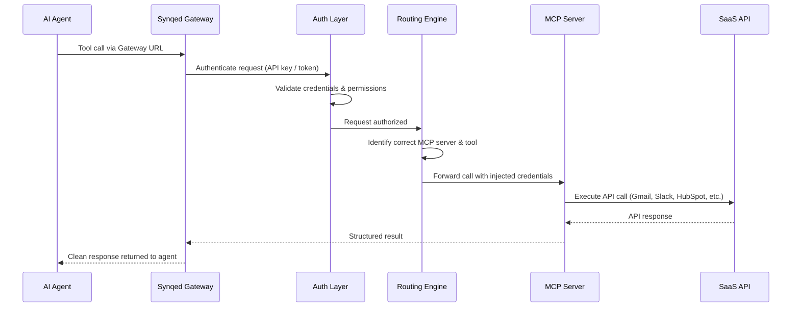

The Synqed MCP Gateway sits between your AI agents and external SaaS services. This page explains the key concepts you need to understand and how a request flows through the system.

### Core Concepts

Before diving into the architecture, here are the building blocks of Synqed:

#### Gateway Config

A Gateway Config is a **blueprint** that defines what your MCP gateway looks like — which servers are included, which tools are exposed, technical settings (rate limits, IP whitelisting), and prompts for orchestrating workflows. Think of it as a template. You can create and update configs without affecting live agents.

#### Gateway Instance

A Gateway Instance is a **live, running gateway** created from a Gateway Config. Each instance has its own unique **Gateway URL** and **API key**. This is what your AI agent actually connects to. A single Gateway Config can produce multiple instances — for different environments (dev, staging, production), different clients, or different agent deployments.

#### Auth Config

An Auth Config is a **blueprint for authentication** with a specific MCP server. It defines the authentication method (OAuth, API Key, etc.), OAuth scopes, and client credentials. For example, a Gmail Auth Config specifies which Gmail scopes your agents need — reading emails, sending messages, managing labels. Auth Configs are reusable across multiple gateways within your organization.

#### Connection

A Connection is an **actual authenticated account** created from an Auth Config. One Auth Config can have multiple connections. For example, a single Gmail Auth Config can have connections for [personal@gmail.com](mailto:personal@gmail.com), [work@gmail.com](mailto:work@gmail.com), and [team@company.com](mailto:team@company.com) — each authenticated and ready for your agents to use.

#### Prompts

Prompts are **MCP primitives** attached to a Gateway Config that guide how the gateway orchestrates tool calls. They act as reusable workflow templates — instructing the gateway on how to analyze requests, sequence tool calls, and automate multi-step actions.

### How a Request Flows

When your AI agent makes a tool call through Synqed, here's what happens under the hood:

