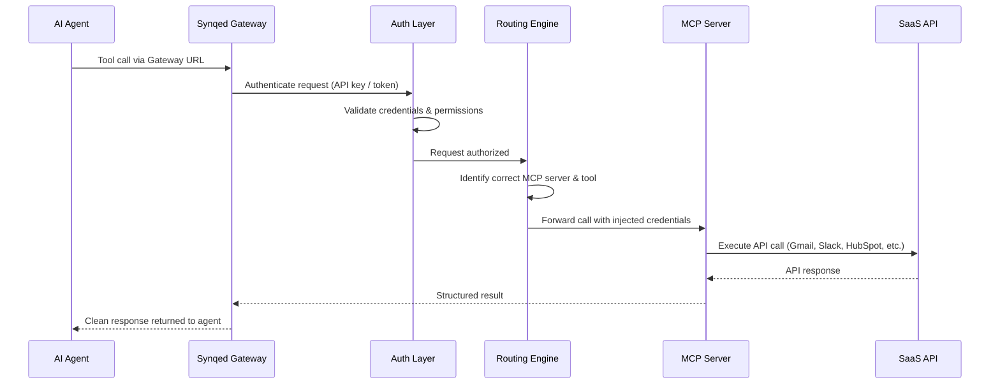
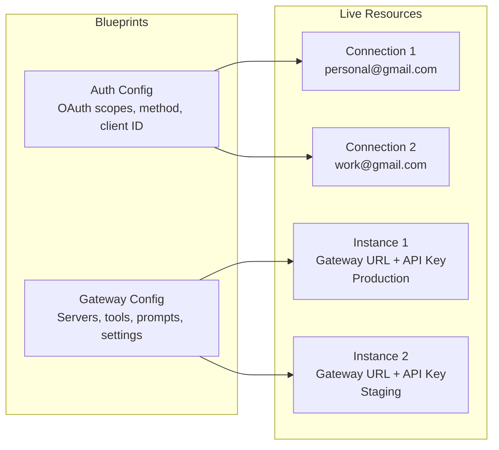
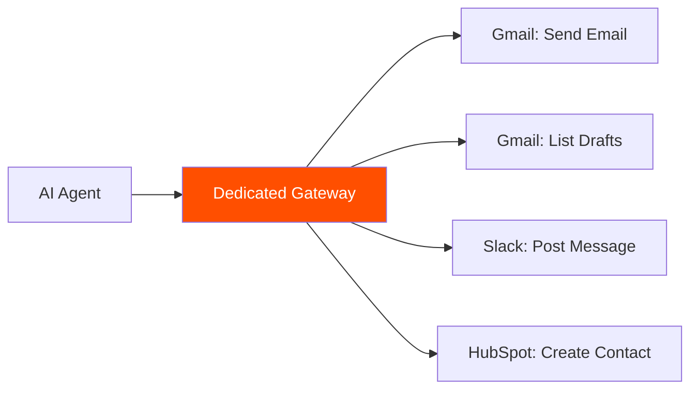
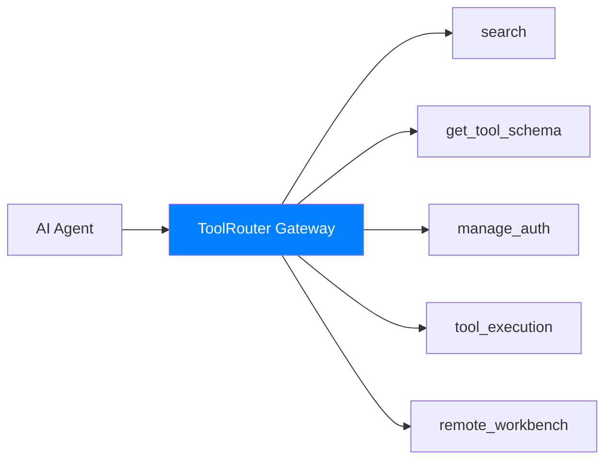

The Synqed MCP Gateway sits between your AI agents and external SaaS services. This page explains the key concepts you need to understand and how a request flows through the system.

### Core Concepts

Before diving into the architecture, here are the building blocks of Synqed:

#### Gateway Config

A Gateway Config is a **blueprint** that defines what your MCP gateway looks like — which servers are included, which tools are exposed, technical settings (rate limits, IP whitelisting), and prompts for orchestrating workflows. Think of it as a template. You can create and update configs without affecting live agents.

#### Gateway Instance

A Gateway Instance is a **live, running gateway** created from a Gateway Config. Each instance has its own unique **Gateway URL** and **API key**. This is what your AI agent actually connects to. A single Gateway Config can produce multiple instances — for different environments (dev, staging, production), different clients, or different agent deployments.

#### Auth Config

An Auth Config is a **blueprint for authentication** with a specific MCP server. It defines the authentication method (OAuth, API Key, etc.), OAuth scopes, and client credentials. For example, a Gmail Auth Config specifies which Gmail scopes your agents need — reading emails, sending messages, managing labels. Auth Configs are reusable across multiple gateways within your organization.

#### Connection

A Connection is an **actual authenticated account** created from an Auth Config. One Auth Config can have multiple connections. For example, a single Gmail Auth Config can have connections for [personal@gmail.com](mailto:personal@gmail.com), [work@gmail.com](mailto:work@gmail.com), and [team@company.com](mailto:team@company.com) — each authenticated and ready for your agents to use.

#### Prompts

Prompts are **MCP primitives** attached to a Gateway Config that guide how the gateway orchestrates tool calls. They act as reusable workflow templates — instructing the gateway on how to analyze requests, sequence tool calls, and automate multi-step actions.

### How a Request Flows

When your AI agent makes a tool call through Synqed, here's what happens under the hood:

**Step by step:**

1. **Agent sends a tool call** — Your AI agent makes a function call to the Gateway URL, just like calling any MCP server.
2. **Gateway authenticates the request** — The gateway validates the API key and checks that the caller has permission to use this gateway.
3. **Credentials are injected** — Synqed retrieves the stored OAuth tokens or API keys for the relevant connection. The agent never sees or handles credentials directly.
4. **Request is routed** — The routing engine identifies which MCP server and tool should handle this call based on the tool name.
5. **MCP server executes** — The call is forwarded to the correct MCP server with proper credentials, parameters, and context.
6. **SaaS API is called** — The MCP server translates the call into the actual SaaS API request (REST, GraphQL, etc.).
7. **Result flows back** — The response travels back through the chain — API → MCP server → Gateway → Agent — as a clean, structured result.

The entire flow happens in milliseconds. Your agent treats the gateway as a single MCP server, completely unaware of the complexity behind it.

### Config & Instance Model

This separation gives you flexibility: update a config without disrupting live instances, spin up new instances for testing, and reuse auth configs across multiple gateways.

### Two Types of Gateways

Synqed offers two gateway types, each suited to different use cases:

#### Dedicated Gateway

You manually select exactly which MCP servers and tools to include. The gateway exposes only what you choose — nothing more.

**Best for:** Production workflows where you know exactly which tools are needed. Deterministic behavior, minimal context overhead.

#### ToolRouter (Coming Soon)

Instead of manually selecting tools, the ToolRouter uses intelligent routing to dynamically search and find the right tools based on the agent's query. No manual tool selection needed.

- **search** — Discover tools by intent across all connected servers
- **get\_tool\_schema** — Fetch the full input/output schema of a specific tool on demand
- **manage\_auth** — Authenticate tools and manage OAuth flows at runtime
- **tool\_execution** — Execute a tool with the correct input parameters and injected credentials
- **remote\_workbench** — A Python workbench for orchestrating multiple tools and handling large results

**Best for:** Exploratory workflows, general-purpose agents, and scenarios where required tools aren't known upfront.