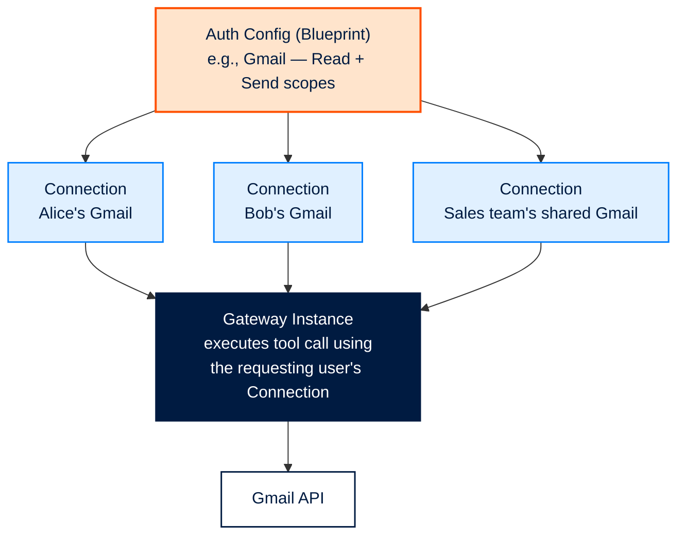

<Tip>
  Before an AI agent can send an email, update a CRM record, or post to Slack, it needs a secure way to act on behalf of a real user's account. Synqed handles this through **Auth Configs** — reusable blueprints that define the permissions, scopes, and authentication method for each MCP server your agents use.
</Tip>

### **The core idea**

Every MCP server in Synqed — Gmail, HubSpot, Slack, GitHub, Notion, and more — operates through a connected user account. That account is connected to Synqed based on an Auth Config: a saved blueprint that specifies how the OAuth handshake should happen, which scopes should be requested, and what permissions the connected account will grant.

Think of it as a template. You define the blueprint once — for example, "Gmail with read \+ send scopes" — and then any number of users in your organisation can connect their Gmail accounts against that same blueprint. The resulting connected account is called a Connection, and every Connection traces back to the Auth Config that created it.

#### **Auth Config vs. Connection**

It's worth distinguishing the two concepts clearly:

- An **Auth Config** is the blueprint. It specifies the MCP server, the authentication method (OAuth, API key, etc.), and the exact scopes the account will be granted.
- A **Connection** is a live, authenticated account created from an Auth Config. It holds the actual OAuth tokens, the user identity, and the granted permissions — and it's what the gateway uses at runtime to execute tool calls.

You create Auth Configs once per server per use case. You create Connections every time a user connects their account.

#### **How Auth Configs fit into the bigger picture**

A simple way to think about it:

Auth Config (blueprint) → Connection 1 (Alice's Gmail), Connection 2 (Bob's Gmail), Connection 3 (Sales Team's shared Gmail)...

When you attach an MCP server to a Gateway Config, you pick which Auth Config governs it. At runtime, the gateway uses the Connection tied to the requesting user to execute the tool call against the real SaaS API.

#### **Why this separation matters**

Keeping Auth Configs separate from Connections gives you three things:

- **Reusability.** Define a server's auth setup once at the organization level and reuse it across every gateway you build — no duplicated scope configurations.
- **Centralized governance.** IT teams can audit exactly which permissions have been granted to which services from one screen, instead of reviewing auth code across dozens of integrations.
- **Controlled access.** Changing the blueprint (e.g., tightening scopes) cascades in a predictable way, and revoking or rotating credentials is a single operation.

#### **Security implications**

Auth Configs are security-sensitive — they determine the exact level of access your agents will have into a user's SaaS account. A few principles to keep in mind:

- Least privilege. Request only the scopes your agent actually needs. A Gmail Auth Config for a "send-only" agent shouldn't include read scopes.
- One config per intent. If you have a read-only analytics agent and a read-write support agent using Gmail, create two separate Auth Configs with different scope sets rather than reusing a maximal-scope config for both.
- Secure token storage. Connections store OAuth tokens encrypted at rest in Synqed's SOC 2–compliant infrastructure. Tokens are never exposed to your agent code.
- Permission-based access. Any team member can create an Auth Config based on the permissions their workflow requires — it's not limited to admins. This keeps builders unblocked while still giving the organisation a single place to audit everything that's been configured.

#### Visualising the blueprint model

